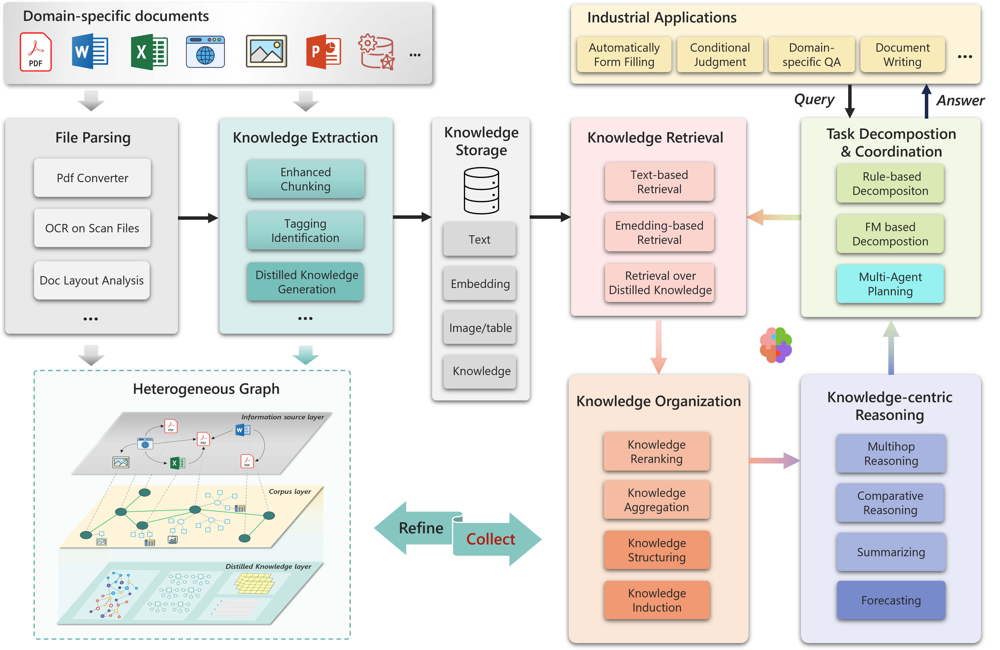
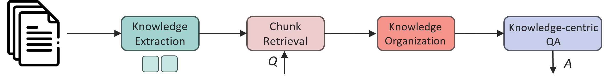
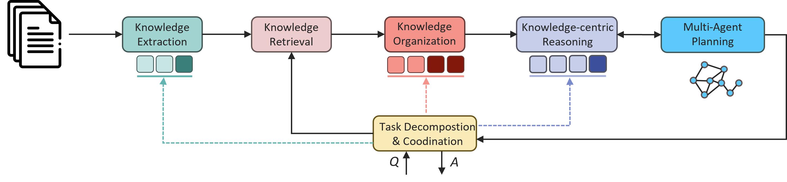

    

    <a href="https://pike-rag.azurewebsites.net/">🌐Online Demo</a>
    <a href="https://arxiv.org/abs/2501.11551">📊Technical Report</a>

# PIKE-RAG: sPecIalized KnowledgE and Rationale Augmented Generation

## Why PIKE-RAG?

In recent years, Retrieval Augmented Generation (RAG) systems have made significant progress in extending the capabilities of Large Language Models (LLM) through external retrieval. However, these systems still face challenges in meeting the complex and diverse needs of real-world industrial applications. Relying solely on direct retrieval is insufficient for extracting deep domain-specific knowledge from professional corpora and performing logical reasoning. To address this issue, we propose the PIKE-RAG (sPecIalized KnowledgE and Rationale Augmented Generation) method, which focuses on extracting, understanding, and applying domain-specific knowledge while building coherent reasoning logic to gradually guide LLMs toward accurate responses.

    

PIKE-RAG framework mainly consists of several basic modules, including document parsing, knowledge extraction, knowledge storage, knowledge retrieval, knowledge organization, knowledge-centric reasoning, and task decomposition and coordination. By adjusting the submodules within the main modules, it is possible to achieve RAG systems that focus on different capabilities to meet the diverse needs of real-world scenarios.

For example, in case *patient's historical medical records searching*, it focuses on the *factual information retrieval capability*. The main challenges are that (1) the understanding and extraction of knowledge are often hindered by inappropriate knowledge segmentation, disrupting semantic coherence, leading to a complex and inefficient retrieval process; (2) commonly used embedding-based knowledge retrieval is limited by embedding models' ability to align professional terms and aliases, reducing system accuracy. With PIKE-RAG, we can improve the accuracy of knowledge extraction and retrieval by using context-aware segmentation techniques, automatic term label alignment techniques, and multi-granularity knowledge extraction methods during the knowledge extraction process, thereby enhancing factual information retrieval capability, as shown in the pipeline below.

    

For complex task like *reasonable treatment plans and coping measures suggestions for patients*, it requires more advanced capabilities: strong domain-specific knowledge are required to accurately understand the task and sometimes reasonably decompose it; advanced data retrieval, processing and organization techniques are also required for potential tendency prediction; while multi-agents planning will also be useful to take considerations of both creativity and reliance. In such case, a richer pipeline below can be initialized to achive this.

    

In public benchmark tests, PIKE-RAG demonstrated excellent performance on several multi-hop question answering datasets such as HotpotQA, 2WikiMultiHopQA, and MuSiQue. Compared to existing benchmark methods, PIKE-RAG excelled in metrics like accuracy and F1 score. On the HotpotQA dataset, PIKE-RAG achieved an accuracy of 87.6%, on 2WikiMultiHopQA it reached 82.0%, and on the more challenging MuSiQue dataset, it achieved 59.6%. These results indicate that PIKE-RAG has significant advantages in handling complex reasoning tasks, especially in scenarios that require integrating multi-source information and performing multi-step reasoning.

PIKE-RAG has been tested and significantly improved question answering accuracy in fields such as industrial manufacturing, mining, and pharmaceuticals. In the future, we will continue to explore its application in more fields. Additionally, we will continue to explore other forms of knowledge and logic and their optimal adaptation to specific scenarios.

## For More Details

- 📊 [Technical Report](https://arxiv.org/abs/2501.11551) will illustrate the industrial RAG problem classification, introduce the main components in PIKE-RAG, and show some experimental results in public benchmarks.
- 🌐 [Online Demo](https://pike-rag.azurewebsites.net/) is a show-case of our Knowledge-Aware decomposition pipeline for L2 RAG task.

## Quick Start

1. Clone this repo and set up the Python environment, refer to [this document](docs/guides/environment.md);
2. Create a `.env` file to save your endpoint information (and some other environment variables if needed), refer to [this document](docs/guides/env_file.md);
3. Modify the *yaml config* files and try the scripts under *examples/*, refer to [this document](docs/guides/examples.md);
4. Build up your own pipeline and/or add your own components!

## Contributing

This project welcomes contributions and suggestions.  Most contributions require you to agree to a
Contributor License Agreement (CLA) declaring that you have the right to, and actually do, grant us
the rights to use your contribution. For details, visit https://cla.opensource.microsoft.com.

When you submit a pull request, a CLA bot will automatically determine whether you need to provide
a CLA and decorate the PR appropriately (e.g., status check, comment). Simply follow the instructions
provided by the bot. You will only need to do this once across all repos using our CLA.

This project has adopted the [Microsoft Open Source Code of Conduct](https://opensource.microsoft.com/codeofconduct/).
For more information see the [Code of Conduct FAQ](https://opensource.microsoft.com/codeofconduct/faq/) or
contact [opencode@microsoft.com](mailto:opencode@microsoft.com) with any additional questions or comments.

## Trademarks

This project may contain trademarks or logos for projects, products, or services. Authorized use of Microsoft
trademarks or logos is subject to and must follow
[Microsoft's Trademark & Brand Guidelines](https://www.microsoft.com/en-us/legal/intellectualproperty/trademarks/usage/general).
Use of Microsoft trademarks or logos in modified versions of this project must not cause confusion or imply Microsoft sponsorship.
Any use of third-party trademarks or logos are subject to those third-party's policies.
